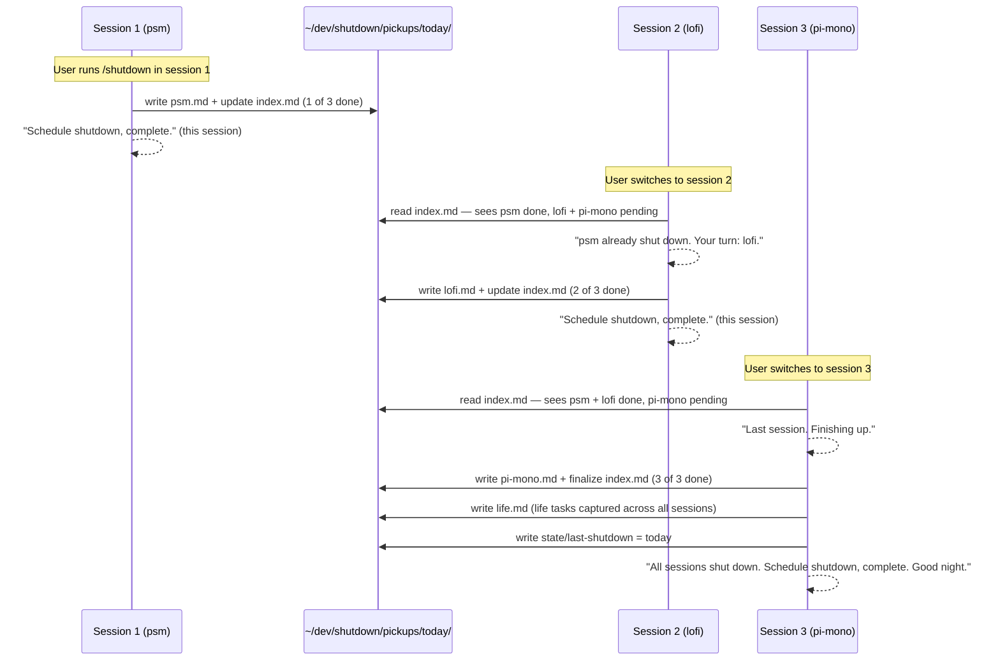
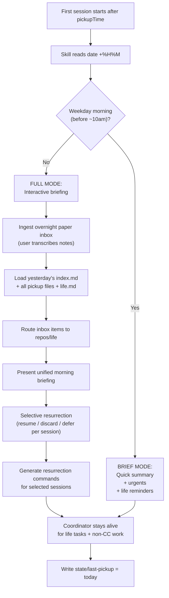

# Plan: Nightly Shutdown & Next-Day Pickup

**Status**: implementing (v5)
**Location**: `~/dev/shutdown/` (centralized, cross-repo)

---

## Overview

A `/shutdown` skill for Claude Code that enforces a consistent nightly shutdown ritual — every day, same time, no exceptions — with structured context preservation across multiple repos/sessions and life tasks, plus a `/pickup` companion for next-day resurrection.

Inspired by [Cal Newport's work shutdown ritual](https://calnewport.com/drastically-reduce-stress-with-a-work-shutdown-ritual/) — the system builds **mental trust** through a structured review process so that once the ritual completes, work worries can be redirected: "I completed the ritual, everything is captured and managed. There is no need to worry."

### Newport's Five Steps (adapted for Claude Code)

| Newport's Step | Our Automation |
|---|---|
| 1. Update master task lists | Auto-tally: git status, uncommitted work, active tasks across all sessions + life tasks |
| 2. Review all task lists | Show pending items, flag urgents, let user annotate priorities for tomorrow |
| 3. Check calendar (next 2 weeks) | Surface upcoming deadlines, scheduled deploys, PR review requests, life deadlines |
| 4. Review weekly plan | Show progress against current plan files in `docs/abz-b/` |
| 5. Say "Schedule shutdown, complete" | Termination phrase triggers final save |

The key insight: the ritual must be **convincing enough** that when work thoughts arise in the evening, the mind accepts "the system captured everything" without triggering a stress spiral. And for the ideas that *do* slip through — there's a paper inbox waiting (see [Phase 3](#phase-3--overnight-inbox-paper--pen)).

### Design Principles

1. **No cron jobs, no shell scripts** — the `UserPromptSubmit` hook runs `date +%H%M` (a single macOS command, not a script). The skill prompt reads the time and does all reasoning — time windows, reminder, shutdown, lockout. Claude Code is the clock and the gate.
2. **Negotiation, not gating** — Claude understands what you're asking. Finishing in-flight work? Go ahead. Starting a fresh feature at 22:00? Push back. Production emergency? No keyword needed — Claude can tell. Escalating nudges, not hard blocks.
3. **Same schedule every day** — no `skipDays`. Weekdays, weekends, holidays, vacations — shutdown at 21:30, always. Consistency trains the habit. The cadence is the point.
4. **Adaptive morning** — pickup time is the same every day, but the *depth* of the morning briefing adapts. Weekday mornings (when the user leaves for office) get a brief summary. Weekend/evening first-touch gets the full interactive briefing.
5. **Life tasks included** — tax filings, greeting cards, errands live alongside repo tasks. The system manages the whole day, not just code.
6. **Paper inbox for post-shutdown ideas** — when the mind surfaces an idea after shutdown, there must be a reliable, zero-friction capture that doesn't require opening a screen. Paper + pen with minimum shorthands.
7. **Baton-passing shutdown** — when multiple sessions are active, each session completes its own shutdown and writes its pickup file. The next session to interact sees the updated index and continues the ritual. The last session standing finalizes the daily index.
8. **Selective resurrection** — pickup doesn't blindly reopen everything. It presents each previous session with enough context (project, pwd, branch, tasks, subjects) for the user to decide: resume, discard, or defer. The coordinator session stays alive for life tasks after all resurrections.

---

## Architecture

### Directory Structure

```
~/dev/shutdown/
├── plan-shutdown-pickup.md        # this plan
├── config.json                    # schedule + preferences
├── overrides.log                  # post-shutdown work audit trail
├── inbox/
│   └── 2026-03-31.md              # transcribed overnight paper notes
├── skills/
│   ├── shutdown.md                # /shutdown skill definition
│   └── pickup.md                  # /pickup skill definition
├── state/
│   ├── last-shutdown              # date of last completed shutdown (e.g. "2026-03-30")
│   └── last-pickup                # date of last completed pickup (e.g. "2026-03-31")
└── pickups/
    └── 2026-03-30/
        ├── index.md               # daily manifest (repos + life + session metadata)
        ├── life.md                # non-code tasks
        ├── psm.md                 # pickup file for psm repo
        ├── pi-mono.md             # pickup file for pi-mono repo
        └── lofi.md                # pickup file for lofi repo
```

### Config (`config.json`)

```json
{
  "shutdownTime": "21:30",
  "reminderLeadMinutes": 30,
  "pickupTime": "09:00",
  "timezone": "America/Los_Angeles",
  "inboxShorthands": {
    "!": "urgent",
    "B": "bug",
    "*": "idea"
  }
}
```

No `skipDays`. Every day is a shutdown day.

### Hook Configuration

In `~/.claude/settings.json` (global, applies to all sessions):

```json
{
  "hooks": {
    "UserPromptSubmit": [{
      "command": "date +%H%M",
      "blocking": true
    }]
  }
}
```

One command, no script. The `/shutdown` and `/pickup` skill prompts read this output and reason about what to do.

---

## How the Skill Reads the Clock

The `UserPromptSubmit` hook runs `date +%H%M` on every prompt. The hook output (e.g. `2145`) is visible to the skill. The skill prompt (in `skills/shutdown.md`) contains instructions like:

```
When you see a hook output from `date +%H%M`, read ~/dev/shutdown/config.json
and determine the current time window:

1. Read state/last-shutdown and state/last-pickup for today's status
2. Compare hook time against config times
3. Act according to the time window (see Time Windows below)
```

The skill is loaded into every Claude Code session via the user's global CLAUDE.md or per-project `.claude/settings.json` skill registration. It doesn't need to be explicitly invoked for time-awareness — the hook output triggers the skill's time-checking logic on every prompt.

### Time Windows + Negotiation

```
                 pickupTime          reminderTime        shutdownTime
                   09:00                21:00               21:30
 ─────────┬──────────┬──────────────────┬───────────────────┬──────────
 midnight │ WIND-DOWN│   NORMAL DAY     │   REMINDER        │ NEGOTIATE
 to 09:00 │ (nudge)  │   (work freely)  │   (nudge ritual)  │ (context-aware pushback)
 ─────────┴──────────┴──────────────────┴───────────────────┴──────────
```

| Window | Time | Behavior |
|--------|------|----------|
| **Wind-down** | midnight → pickupTime | Negotiate based on what user is doing (see table below). Not a hard block. |
| **Morning** | pickupTime, first prompt | If `last-pickup` < today: auto-suggest `/pickup`. Adapt briefing depth. |
| **Normal** | pickupTime → reminderTime | Work freely. No interruptions. |
| **Reminder** | reminderTime → shutdownTime | Print reminder banner once: "N min to shutdown. Run `/shutdown` when ready." Allow work to continue. |
| **Post-shutdown** | shutdownTime → midnight | Negotiate — allow wrap-up, resist new work, escalate gradually. |

### Negotiation Model (replaces hard gate)

After shutdownTime, Claude doesn't block — it **negotiates** based on what the user is actually doing:

| What user is doing | Claude's response |
|---|---|
| Fix production bug / urgent incident | Allow freely — don't get in the way of emergencies |
| Commit, push, wrap up in-flight work | Allow — this IS shutdown behavior |
| Quick code review / small fix | Gentle nudge — "quick one? Let's wrap after this." |
| Start a new feature / deep exploration | Push back — "it's past shutdown. Capture this as a tomorrow item?" |
| Long conversation continuing past shutdown | Escalating nudges — first gentle, then firmer, then "let's save and close" |
| "just one more thing" repeatedly | Call it out — "that's the 3rd 'one more thing.' Let's do the ritual." |

**Escalation ladder** (not rigid — Claude adapts to context):
1. First post-shutdown prompt: gentle note — "It's past 21:30. Wrapping up or something urgent?"
2. If new work: "This sounds like tomorrow-work. Want to add it to the inbox instead?"
3. If continuing: "We're 20 min past shutdown. Let's save state and do the ritual."
4. If still going: "We're 45 min past shutdown. I'm going to start the ritual now."
5. Auto-initiate the shutdown ceremony

The key insight: **Claude has the intelligence to understand context**. A rigid gate can't tell the difference between "fix prod outage" and "let me start a new feature at midnight." Claude can.

### Late Ceremony (missed shutdown)

If the user's first Claude Code session of the day is *after* shutdownTime (e.g. opened at 22:00 for the first time), or if they worked all day without Claude Code:

1. Skill detects: `last-shutdown` < today AND current time >= shutdownTime
2. Instead of blocking, offer: "No shutdown ceremony today. Quick late save?"
3. Run a compressed ritual: auto-tally git state for current repo + life items, generate pickup, save
4. Then begin negotiation mode for any further work

---

## Four Phases

### Phase 1 — Reminder / Ritual (T-30min, e.g. 21:00)

**Trigger**: Hook output shows time >= reminderTime. Skill prints reminder banner.

The reminder phase IS the shutdown ritual. It gives the user 30 minutes to walk through Newport's five steps with Claude's help:

**Step 1 — Update master task list** (automated)
- Auto-tally for current repo: `git status`, `git stash list`, uncommitted work
- Read other repos' state from previous pickups or by scanning known repo paths
- Read active tasks from plan files, TODO comments, task lists
- Include life tasks from previous pickups or user input

**Step 2 — Review all task lists** (interactive)
- Show pending items grouped by: repos, then life
- Flag urgent items (upcoming deadlines, failing CI, open PRs, life deadlines)
- User marks priorities and annotates "tomorrow I should..." notes

**Step 3 — Check calendar** (automated where possible)
- Surface upcoming deadlines from plan files, scheduled deploys, PR review requests
- Surface life deadlines (tax filing Apr 15, birthday cards, etc.)
- (Future: integrate with calendar API)

**Step 4 — Review weekly plan** (interactive)
- Show progress against current plan files in `docs/abz-b/` for this repo
- User annotates what changed, what shifted, what's blocked

**Step 5 — Draft pickup file** (automated)
- Generates draft pickup file incorporating all the above
- Generates `life.md` for non-code items
- Saved to `~/dev/shutdown/pickups/YYYY-MM-DD/<repo-slug>.draft.md`
- User reviews and approves or edits

### Phase 1b — Baton-Passing (multi-session shutdown)

When multiple Claude Code sessions are active at reminder/shutdown time, the shutdown is a **relay**, not a broadcast:



**How each session knows about the others:**

- When `/shutdown` runs in any session, it reads `index.md` to see which sessions have already shut down
- It writes its own pickup file and appends its entry to `index.md`
- The **last session** to shut down also finalizes `life.md` and writes `state/last-shutdown`
- Each session's pickup file captures enough context for the next session to know the baton has been passed

**`index.md` during multi-session shutdown (in-progress):**

```markdown
# Shutdown Index — 2026-03-30

## Sessions (3 total)

| # | Repo | Branch | Status | Dirty files | Priority note |
|---|------|--------|--------|-------------|---------------|
| 1 | [psm](psm.md) | feat/shutdown-skill | ✅ shut down | 3 | finish enforcement hook |
| 2 | [lofi](lofi.md) | feat/audio-engine | ⏳ pending | 7 | mid-refactor |
| 3 | [pi-mono](pi-mono.md) | main | ⏳ pending | 0 | review only |

## Life Tasks
See [life.md](life.md) — finalized by last session
```

### Phase 2 — Shutdown / "Schedule shutdown, complete" (T-0, e.g. 21:30)

The termination phrase — borrowed directly from Newport — is the hard cut.

**Trigger**: Hook output shows time >= shutdownTime. Skill detects `last-shutdown` < today.

For the session where shutdown is triggered:
1. If `/shutdown` ritual was completed → finalize draft into pickup file
2. If ritual was NOT completed → auto-generate a compressed pickup (less thorough, but nothing lost)
3. Writes its pickup file → `~/dev/shutdown/pickups/YYYY-MM-DD/<repo-slug>.md`
4. Updates `index.md` with its entry
5. If this is the last pending session → finalize `life.md`, write `state/last-shutdown`
6. If other sessions still pending → note them in index, remind user to switch
7. Optionally commits uncommitted WIP to a `wip/shutdown-YYYY-MM-DD` branch
8. Reminds user about the paper inbox for overnight ideas
9. Per-session termination:
   ```
   Schedule shutdown, complete. (psm)
   2 sessions remaining: lofi, pi-mono.
   Switch to the next session to continue shutdown.
   ```
10. Final session termination:
    ```
    Schedule shutdown, complete. All sessions done.
    Everything is captured. Pickup available tomorrow at 09:00.

    Overnight ideas → paper inbox (shorthand card by the bed).
    Good night.
    ```
11. Refuses all subsequent prompts until pickupTime

### Phase 3 — Overnight Inbox (Paper + Pen)

**The problem**: After shutdown, the mind keeps generating ideas. Opening a laptop to capture them defeats the purpose. But letting them evaporate causes anxiety ("what if I forget?").

**The solution**: A physical paper inbox with minimum shorthands.

#### The Shorthand Card

A small card (index card or sticky note) kept next to the bed / on the fridge. Only 3 shorthands to remember — or write anything at all, Claude will sort it out in the morning:

```
OVERNIGHT INBOX
─────────────────────────────
! = urgent     B = bug
* = idea
─────────────────────────────
Just write anything. Shorthand optional.
Claude sorts it in the morning.

Examples:
  ! psm stripe cert expires Apr 2
  B sync rate limiter double-counts
  voice channel auto-mute on idle
  send Mom birthday card
  tax filing — check if CPA needs W-2
  can lofi use WebCodecs for encoding?
```

#### Rules for the paper inbox

1. **One line per idea** — forces compression, prevents spiraling into design
2. **Shorthand optional** — `!` for urgent, `B` for bug, `*` for idea. Or just write free-form. No pressure.
3. **Repo name optional** — include it if obvious, skip it if not. Claude infers during morning ingestion.
4. **No solutions** — capture the *what*, not the *how*. Solutions are tomorrow's work.
5. **Anything goes** — misspellings, fragments, half-sentences. The point is to get it out of your head and onto paper so you can go back to sleep.
6. **Trust the system** — writing it down means it's captured. Back to rest.

#### Morning ingestion

The paper inbox is transcribed into `~/dev/shutdown/inbox/YYYY-MM-DD.md` at the start of the next day (during `/pickup`). The user types or dictates; Claude formats and routes each item to the appropriate repo's pickup context.

The user's raw paper notes might look like:

```
! psm stripe cert expires Apr 2
B sync rate limiter double-counts
voice channel auto-mute on idle
send Mom birthday card
tax filing — check if CPA needs W-2
can lofi use WebCodecs for encoding?
```

Claude parses these into:

```markdown
# Overnight Inbox — 2026-03-31

| # | Type | Target | Idea | Routed to |
|---|------|--------|------|-----------|
| 1 | urgent | psm | stripe webhook cert expires Apr 2 | psm pickup |
| 2 | bug | sync | rate limiter double-counts retries | sync pickup |
| 3 | idea | psm | voice channel auto-mute on idle | psm pickup |
| 4 | life | — | send Mom birthday card | life |
| 5 | life | — | tax filing — check if CPA needs W-2 | life |
| 6 | question | lofi | can we use WebCodecs for encoding? | lofi pickup |
```

Note: Claude infers type and target from context. "send Mom birthday card" → life. "can lofi use WebCodecs" → question, routed to lofi. No pressure on the user to get the format right at 2am.

### Phase 4 — Morning Pickup (first session resurrects all)

**Trigger**: Hook output shows time >= pickupTime. Skill detects `last-pickup` < today. The first Claude Code session of the day — regardless of which repo it's in — becomes the **morning coordinator**.

#### Adaptive Briefing Depth

The morning briefing adapts to context. The user's first interaction tells the skill what kind of morning this is:

| Signal | Briefing mode | Behavior |
|--------|---------------|----------|
| Weekday, morning hours (before ~10am) | **Brief** | User is heading to office. Quick summary, no interactive review. Print urgents + life reminders + resurrection list. User picks up sessions after work. |
| Weekend / evening / explicit `/pickup` | **Full** | Interactive: ingest inbox, review each session, selective resurrection, life task review |
| First interaction is after work (weekday, ~17:00+) | **Full** | User is back from office, ready to work. Full interactive briefing. |

The skill infers mode from the time and day-of-week, but the user can always override: "just the brief version" or "give me the full briefing."

#### Morning Coordinator Flow



#### Selective Resurrection

The pickup doesn't blindly reopen everything. For each previous session, the coordinator presents:

```
SESSION 1 of 3: psm
  Project: Private Space Manager (PWA + Cloudflare Worker)
  pwd:     ~/dev/2026/psm
  Branch:  feat/shutdown-skill
  Tasks:   2 of 5 remaining (implement cron trigger, wire gate hook)
  Subject: building /shutdown skill for nightly ritual
  Plan:    docs/abz-b/plan-shutdown-pickup.md (30% complete)
  Dirty:   3 files (src/skills/shutdown.ts, src/hooks/gate.sh, config.json)
  Inbox:   +2 items (F: auto-mute, U: stripe cert expiry)

  → [R]esume  [D]iscard  [L]ater
```

- **Resume** → generate `cd ~/dev/2026/psm && claude` command + `/pickup psm` instruction
- **Discard** → mark session as "discarded" in index (git state preserved, just not resurrected)
- **Later** → defer to tomorrow's pickup (carry forward)

The user walks through each session and decides. This prevents session sprawl — dead sessions get explicitly discarded rather than lingering.

#### The Coordinator Stays Alive

After guiding resurrection of all chosen sessions, the first/coordinator session does NOT close. It stays alive as the **life task hub**:

- Manages `life.md` carry-forward items
- Handles non-Claude-Code tasks (reminders, errands, research lookups)
- Serves as the "general assistant" session for the day
- At next shutdown, it writes `life.md` and any general notes

This means the coordinator session is always the one in whichever repo the user happened to open first — it doesn't need to be a specific repo. Its role shifts from "code assistant" to "day manager" after resurrection is complete.

#### `/pickup <repo>` in Subsequent Sessions

When the user opens a new Claude Code session in a specific repo and runs `/pickup psm`:

1. Reads `~/dev/shutdown/pickups/YYYY-MM-DD/psm.md`
2. Loads routed inbox items for this repo
3. Shows repo-specific context (branch, dirty files, tasks, plan progress)
4. Does NOT re-run the full morning briefing (coordinator already did that)
5. Asks "Ready to continue from where you left off?"

---

## Pickup File Format

Each pickup file captures enough context for selective resurrection — the coordinator needs to present the session's identity without opening the repo:

```markdown
# Pickup — psm — 2026-03-30

## Session Identity
- **Project**: Private Space Manager (PWA + Cloudflare Worker + Fly.io backend)
- **pwd**: ~/dev/2026/psm
- **Branch**: feat/shutdown-skill
- **Subject**: building /shutdown skill for nightly ritual
- **Plan**: docs/abz-b/plan-shutdown-pickup.md (30% complete)

## Status at shutdown
- **Uncommitted changes**: 3 files modified
- **WIP branch**: wip/shutdown-2026-03-30 (auto-committed)

## Active tasks
1. [x] Design shutdown/pickup skill
2. [x] Write plan v3
3. [ ] Implement gate.sh + hook wiring
4. [ ] Write /shutdown skill prompt
5. [ ] Write /pickup skill prompt

## Context for tomorrow
- Was mid-way through implementing the gate hook
- The skill prompt needs to handle multi-session baton passing
- Blocked on: nothing

## User notes
- "Focus on the enforcement hook first thing tomorrow"

## Overnight inbox items (routed here)
- F: voice channel auto-mute on idle
- U: stripe webhook cert expires Apr 2

## Git state
- Last commit: abc1234 "feat: add shutdown skill skeleton"
- Stash: none
- Dirty files: src/skills/shutdown.ts, src/hooks/gate.sh, config.json
```

## Daily Index (`index.md`)

```markdown
# Shutdown Index — 2026-03-30

## Sessions

| # | Repo | pwd | Branch | Subject | Status | Dirty | Priority |
|---|------|-----|--------|---------|--------|-------|----------|
| 1 | [psm](psm.md) | ~/dev/2026/psm | feat/shutdown-skill | /shutdown skill | ✅ done | 3 | finish hook |
| 2 | [lofi](lofi.md) | ~/dev/2026/lofi | feat/audio-engine | audio refactor | ✅ done | 7 | fragile mid-refactor |
| 3 | [pi-mono](pi-mono.md) | ~/dev/poto/reefnbid-api | main | API review | ✅ done | 0 | low priority |

## Life Tasks
See [life.md](life.md)

## Overnight Inbox
See [../inbox/2026-03-31.md](../inbox/2026-03-31.md) (populated during morning pickup)
```

---

## Life Tasks

Non-code tasks (tax filing, greeting cards, errands, appointments) are first-class citizens in the shutdown system:

- **During shutdown ritual**: Step 2 asks "Any life tasks to capture?" alongside repo review
- **Pickup file**: `life.md` sits alongside repo pickup files in the daily directory
- **Inbox shorthand**: `L` routes to `life.md` instead of a repo
- **Morning briefing**: Life items shown in their own section with time-to-deadline
- **Carry-forward**: Incomplete life tasks auto-carry to the next day's `life.md` until done or explicitly dropped
- **Coordinator session**: After resurrection, the first session stays alive to manage life tasks

### `life.md` Format

```markdown
# Life Tasks — 2026-03-30

## Active
- [ ] Tax filing — deadline Apr 15 (15 days) — gather W-2 from employer portal
- [ ] Mom's birthday card — Apr 5 (5 days) — buy + mail by Apr 3
- [ ] Dentist appointment — schedule for April

## Completed today
- [x] Grocery run

## Notes
- "Check if CPA needs anything else for tax filing"
```

---

## Edge Cases

| Scenario | Behavior |
|----------|----------|
| No active work at shutdown | Minimal pickup: "clean state, nothing pending" + life tasks |
| User closed all sessions before shutdownTime | Next session (whenever) detects `last-shutdown` < today, runs late ceremony |
| Never opened CC that day | Next morning: `last-shutdown` is stale, skip to fresh pickup |
| First CC session is after shutdownTime | Late ceremony: quick tally + save, then lockout |
| Production emergency after shutdown | Claude recognizes urgency from context, allows freely, no keyword needed |
| Multiple sessions same repo (different branches) | Each gets its own pickup entry, keyed by `<repo>-<branch-slug>` |
| Only 1 session active | That session does the full ritual + life tasks + finalize, no baton passing needed |
| Session left pending after user sleeps | Next morning: coordinator sees it as "pending" in index, offers to generate pickup from git state |
| User ignores reminder, keeps working | At shutdownTime, auto-save on next prompt |
| No overnight inbox notes | Skip ingestion step, proceed with pickup files only |
| User opens session in non-tracked repo | `/pickup` shows cross-repo briefing but no repo-specific pickup |
| Multiple days without shutdown (vacation) | `last-shutdown` is days old — skip ceremony, clear state, fresh start |
| Paper inbox has items for unknown repo | Route to a "general" section in the index |
| Life task past deadline | Flag as overdue in morning briefing |
| Weekday morning, user says "full briefing" | Override brief mode, run full interactive briefing |
| Weekend, user says "just the brief" | Override full mode, run brief summary |
| User discards a session at pickup | Marked "discarded" in index, not resurrected, git state preserved |
| User defers a session at pickup | Carried forward to tomorrow's pickup |

---

## Implementation Increments

### Increment 1: Hook + config + state
- Write `config.json` with defaults (no `skipDays`)
- Add `date +%H%M` hook to `~/.claude/settings.json`
- Create `state/` directory with `last-shutdown`, `last-pickup` files
- **Files**: `config.json`, `state/last-shutdown`, `state/last-pickup`

### Increment 2: `/shutdown` skill
- Write skill definition `skills/shutdown.md`
- Skill reads hook time output + config.json + state files
- Implements time window detection (normal / reminder / shutdown / lockout)
- Implements Newport's five ritual steps (including life tasks)
- Implements baton-passing: read/write index.md, per-session pickup files
- Last session finalizes life.md + writes state/last-shutdown
- Generates pickup file with full session identity (project, pwd, branch, tasks, subject, plan)
- Prints shorthand card reminder + termination phrase
- Handles late ceremony (missed shutdown)
- **Files**: `skills/shutdown.md`

### Increment 3: `/pickup` skill (morning coordinator + selective resurrection)
- Write skill definition `skills/pickup.md`
- First session = morning coordinator:
  - Adaptive briefing depth (brief for weekday mornings, full otherwise)
  - Ingest overnight inbox
  - Load all pickups + life.md
  - Selective resurrection: present each session, user chooses resume/discard/later
  - Generate resurrection commands for chosen sessions
  - Coordinator stays alive as life task hub / general assistant
- `/pickup <repo>` for subsequent sessions:
  - Load repo-specific pickup + routed inbox items
  - Restore context, no full briefing
- Life task carry-forward logic (including deferred sessions)
- Write `state/last-pickup`
- **Files**: `skills/pickup.md`

### Increment 4: Polish
- `overrides.log` rotation
- Multi-day gap handling (vacation)
- Life task deadline tracking + overdue alerts
- Deferred session carry-forward across days
- Edge case hardening

---

## Glossary

| Term | Definition |
|------|-----------|
| **Pickup file** | Markdown file capturing session state + identity at shutdown for selective next-day resumption |
| **Session identity** | Project name, pwd, branch, subject, plan, tasks — enough to decide resume/discard/defer without opening the repo |
| **Life tasks** | Non-code items (tax, errands, cards) tracked in `life.md` alongside repo pickups |
| **Negotiation** | Post-shutdown, Claude allows wrap-up and emergencies but resists new work — escalating nudges, not hard blocks |
| **Daily index** | `index.md` manifest linking all repos' pickup files + life tasks + shutdown progress |
| **WIP branch** | Optional auto-committed branch (`wip/shutdown-YYYY-MM-DD`) for uncommitted work |
| **Overnight inbox** | Paper-based capture system with single-letter shorthands, transcribed during morning pickup |
| **Morning coordinator** | The first Claude Code session after `pickupTime` — runs briefing, guides resurrection, stays as life task hub |
| **Baton-passing** | Multi-session shutdown where each session writes its pickup and the next session sees the updated index |
| **Selective resurrection** | User chooses per-session: resume, discard, or defer to tomorrow |
| **Shorthand card** | Physical reference card with category letters (!, B, *) for overnight note-taking — or just free-form |
| **Late ceremony** | Compressed shutdown ritual when user's first session is after shutdownTime |
| **Brief mode** | Weekday morning quick summary — urgents + life + resurrection list, no interactive review |
| **Full mode** | Interactive briefing — inbox ingestion, session-by-session review, selective resurrection |

---

## Original Prompts

> i want to create a skill `/shutdown` for nightly shutdown and next day pickup and require claude code to execute the skill everynight at scheduled time (e.g. 9:30pm) with reminder starting NN minutes earlier (e.g. 30 or 60 minutes) for me to think shutting down the day.
>
> I might be working on different repos with multiple claude code sessions, so the shutdown should consider that and arrange for orderly save of existing sessions/tasks to be picked up the next day.
>
> starting from the reminder time, shutdown should quickly tally tasks to be picked up the next day, almost like `/compact` and suggest location for the pickup file, while keeping a centralized file pointing each pickup file, so other claude code is also aware of the other sessions.
>
> all processes should be designed to create the final pickup file at scheduled shutdown time and automatically start to save the final pickup file at scheduled time and exit, and refuse to start until the next day scheduled "pickup" time or a break-glass emergency happens for production systems.
>
> Location: `~/dev/shutdown/` (not `~/.claude/` — requires elevated permission)

> **Inspiration**: [Cal Newport — Drastically Reduce Stress with a Work Shutdown Ritual](https://calnewport.com/drastically-reduce-stress-with-a-work-shutdown-ritual/)
> Newport's five steps: (1) update master task lists, (2) review all task lists, (3) check calendar, (4) review weekly plan, (5) say "Schedule shutdown, complete." The ritual builds mental trust so work worries can be redirected in the evening.

> Refinements (v2):
> 1. No cron jobs — Claude Code picks up from the UserPromptSubmit hook
> 2. Overnight inbox — paper + pen with minimum shorthands for post-shutdown ideas
> 3. First session resurrects all — morning coordinator ingests inbox, reviews all pickups, guides resurrection order

> Refinements (v3):
> 1. No shell scripts — hook is just `date +%H%M`, all logic lives in the skill prompt
> 2. Life tasks (tax filing, greeting cards, etc.) are first-class alongside repo tasks
> 3. Late ceremony — if user never opened CC before shutdown time, first session offers compressed ritual
> 4. `L` shorthand added to paper inbox for life/non-code items

> Refinements (v4):
> 1. Baton-passing shutdown — each session completes its own ritual and writes pickup, next session sees index and continues
> 2. Same schedule every day — no skipDays, consistency trains the habit
> 3. Adaptive morning briefing — weekday mornings are brief (heading to office), weekends/evenings are full interactive
> 4. Selective resurrection — each previous session presented with full identity, user chooses resume/discard/defer
> 5. Coordinator stays alive — first session becomes life task hub + general assistant after resurrection
> 6. Pickup files include session identity (project, pwd, branch, tasks, subject, plan) for informed resurrection decisions

> Refinements (v5):
> 1. Negotiation replaces hard gate — Claude understands context (urgent fix vs new feature at midnight)
> 2. No break-glass keyword needed — Claude can tell when something is urgent
> 3. Escalating nudges instead of hard blocks — gentle → firmer → "let's save and close"
> 4. Inbox shorthands reduced to 3 (!, B, *) — or just free-form, Claude sorts it in the morning
