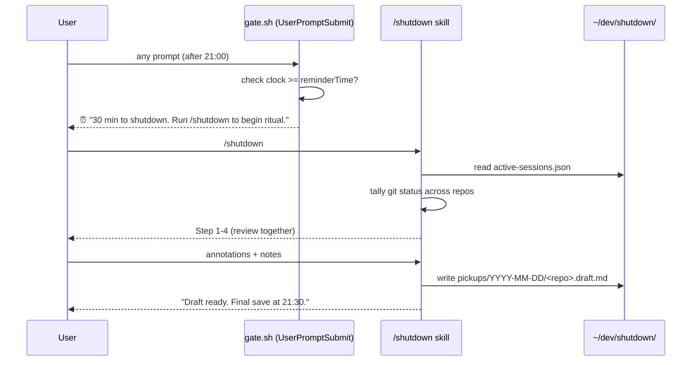
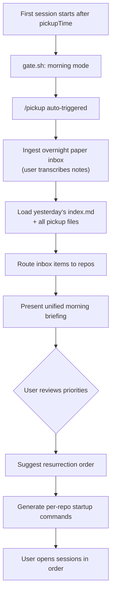

# Plan: Nightly Shutdown & Next-Day Pickup

**Status**: 0% — proposal (v2)
**Location**: `~/dev/shutdown/` (centralized, cross-repo)

---

## Overview

A `/shutdown` skill for Claude Code that enforces nightly shutdown with structured context preservation across multiple repos/sessions, and a `/pickup` companion for next-day resurrection of all sessions.

Inspired by [Cal Newport's work shutdown ritual](https://calnewport.com/drastically-reduce-stress-with-a-work-shutdown-ritual/) — the system builds **mental trust** through a structured review process so that once the ritual completes, work worries can be redirected: "I completed the ritual, everything is captured and managed. There is no need to worry."

### Newport's Five Steps (adapted for Claude Code)

| Newport's Step | Our Automation |
|---|---|
| 1. Update master task lists | Auto-tally: git status, uncommitted work, active tasks across all sessions |
| 2. Review all task lists | Show pending items, flag urgents, let user annotate priorities for tomorrow |
| 3. Check calendar (next 2 weeks) | Surface upcoming deadlines, scheduled deploys, PR review requests |
| 4. Review weekly plan | Show progress against current plan files in `docs/abz-b/` |
| 5. Say "Schedule shutdown, complete" | Termination phrase triggers final save + gate activation |

The key insight: the ritual must be **convincing enough** that when work thoughts arise in the evening, the mind accepts "the system captured everything" without triggering a stress spiral. And for the ideas that *do* slip through — there's a paper inbox waiting (see [Phase 3](#phase-3--overnight-inbox-paper--pen)).

### Design Principles

1. **No cron jobs** — Claude Code's `UserPromptSubmit` hook checks the clock on every prompt. The hook itself is the scheduler. No external cron, no sentinel files, no background daemons.
2. **Paper inbox for post-shutdown ideas** — when the mind surfaces an idea after shutdown, there must be a reliable, zero-friction capture that doesn't require opening a screen. Paper + pen with minimum shorthands.
3. **First session resurrects all** — the first Claude Code session of the next day acts as the morning standup coordinator: ingests overnight paper notes, reviews all pickup files, then guides the user through which sessions to resurrect and in what order.

---

## Architecture

### Directory Structure

```
~/dev/shutdown/
├── plan-shutdown-pickup.md        # this plan
├── config.json                    # schedule + preferences
├── active-sessions.json           # live session registry
├── gate.sh                        # enforcement script (hook target)
├── overrides.log                  # break-glass audit trail
├── inbox/
│   └── 2026-03-31.md              # transcribed overnight paper notes
├── skills/
│   ├── shutdown.md                # /shutdown skill definition
│   └── pickup.md                  # /pickup skill definition
└── pickups/
    └── 2026-03-30/
        ├── index.md               # daily manifest (links all repos)
        ├── psm.md                 # pickup file for psm repo
        ├── pi-mono.md             # pickup file for pi-mono repo
        └── lofi.md                # pickup file for lofi repo
```

### Config (`config.json`)

```json
{
  "shutdownTime": "21:30",
  "reminderLeadMinutes": 30,
  "pickupTime": "09:00",
  "breakGlassKeyword": "PRODUCTION_EMERGENCY",
  "timezone": "America/Los_Angeles",
  "skipDays": ["saturday", "sunday"],
  "inboxShorthands": {
    "B": "bug",
    "F": "feature idea",
    "Q": "question to investigate",
    "U": "urgent — do first",
    "R": "research / read later",
    "T": "tidy / refactor"
  }
}
```

---

## Four Phases

### Phase 1 — Reminder / Ritual (T-30min, e.g. 21:00)

**Trigger**: The `UserPromptSubmit` hook in `gate.sh` checks the clock on every prompt. When current time >= `shutdownTime - reminderLeadMinutes` and no shutdown has been completed today, the hook prints a reminder banner and suggests running `/shutdown`.

No cron. No sentinel files. Claude Code is its own clock.

The reminder phase IS the shutdown ritual. It gives the user 30 minutes to walk through Newport's five steps with Claude's help:

**Step 1 — Update master task list** (automated)
- Auto-tally across all registered sessions: `git status`, `git stash list`, uncommitted work
- Read active tasks from each repo's context (plan files, TODO comments, task lists)
- Surface any items from today that aren't captured anywhere

**Step 2 — Review all task lists** (interactive)
- Show pending items from all sessions, grouped by repo
- Flag urgent items (upcoming deadlines, failing CI, open PRs needing review)
- User marks priorities and annotates "tomorrow I should..." notes

**Step 3 — Check calendar** (automated where possible)
- Surface upcoming deadlines from plan files, scheduled deploys, PR review requests
- (Future: integrate with calendar API)

**Step 4 — Review weekly plan** (interactive)
- Show progress against current plan files in `docs/abz-b/` for this repo
- User annotates what changed, what shifted, what's blocked

**Step 5 — Draft pickup file** (automated)
- Generates draft pickup file incorporating all the above
- Saved to `~/dev/shutdown/pickups/YYYY-MM-DD/<repo-slug>.draft.md`
- User reviews and approves or edits



### Phase 2 — Shutdown / "Schedule shutdown, complete" (T-0, e.g. 21:30)

The termination phrase — borrowed directly from Newport — is the hard cut.

**Trigger**: `gate.sh` detects current time >= `shutdownTime`. On the next prompt:
- If `/shutdown` ritual was completed → finalize draft into pickup file
- If ritual was NOT completed → auto-generate a compressed pickup (less thorough, but nothing lost)

Either way:
1. Finalizes the pickup file → `~/dev/shutdown/pickups/YYYY-MM-DD/<repo-slug>.md`
2. Updates the daily `index.md` manifest (links all sessions' pickup files)
3. Optionally commits uncommitted WIP to a `wip/shutdown-YYYY-MM-DD` branch
4. Reminds user about the paper inbox for overnight ideas
5. Prints the termination message:
   ```
   Schedule shutdown, complete.
   Everything is captured. Pickup available tomorrow at 09:00.

   Overnight ideas → paper inbox (see shorthand card).
   Good night.
   ```
6. Activates the gate — all further prompts blocked until `pickupTime`

### Phase 3 — Overnight Inbox (Paper + Pen)

**The problem**: After shutdown, the mind keeps generating ideas. Opening a laptop to capture them defeats the purpose. But letting them evaporate causes anxiety ("what if I forget?").

**The solution**: A physical paper inbox with minimum shorthands.

#### The Shorthand Card

A small card (index card or sticky note) kept next to the bed / on the fridge:

```
OVERNIGHT INBOX — shorthands
─────────────────────────────
B = bug          F = feature
Q = question     U = urgent
R = research     T = tidy
─────────────────────────────
Format: [letter] [repo] : [idea]
Example: F psm : voice channel auto-mute on idle
         B sync : rate limiter double-counts retries
         Q lofi : can we use WebCodecs for encoding?
         U psm : stripe webhook cert expires Apr 2
```

#### Rules for the paper inbox

1. **One line per idea** — forces compression, prevents spiraling into design
2. **Shorthand letter first** — categorizes without thinking
3. **Repo name** — so morning pickup knows where to route it
4. **Colon, then the idea** — minimum viable description
5. **No solutions** — capture the *what*, not the *how*. Solutions are tomorrow's work.
6. **Trust the system** — writing it down means it's captured. Back to rest.

#### Morning ingestion

The paper inbox is transcribed into `~/dev/shutdown/inbox/YYYY-MM-DD.md` at the start of the next day (during `/pickup`). The user types or dictates; Claude formats and routes each item to the appropriate repo's pickup context.

```markdown
# Overnight Inbox — 2026-03-31

| # | Type | Repo | Idea | Routed to |
|---|------|------|------|-----------|
| 1 | F | psm | voice channel auto-mute on idle | psm pickup |
| 2 | B | sync | rate limiter double-counts retries | sync pickup |
| 3 | Q | lofi | can we use WebCodecs for encoding? | lofi pickup |
| 4 | U | psm | stripe webhook cert expires Apr 2 | psm pickup (urgent) |
```

### Phase 4 — Morning Pickup (first session resurrects all)

**Trigger**: `gate.sh` detects current time >= `pickupTime` and today's pickup hasn't been completed yet. The first Claude Code session of the day — regardless of which repo it's in — becomes the **morning coordinator**.

#### Morning Coordinator Flow



#### Step-by-step

1. **Ingest overnight inbox**
   - Claude asks: "Any overnight notes? Type or dictate them, one per line, using the shorthand format (B/F/Q/U/R/T repo : idea). Or just free-form, I'll categorize."
   - Saves to `~/dev/shutdown/inbox/YYYY-MM-DD.md`
   - Routes each item to the appropriate repo's context

2. **Load all pickup files**
   - Reads `~/dev/shutdown/pickups/YYYY-MM-DD/index.md` (yesterday's)
   - Loads each repo's pickup file
   - Merges in routed inbox items

3. **Morning briefing**
   - Shows unified view across all repos:
     ```
     Good morning. Yesterday's shutdown captured 3 sessions.
     Overnight inbox: 4 items (1 urgent).

     URGENT:
     ⚡ psm: stripe webhook cert expires Apr 2 — handle today

     SESSION SUMMARY:
     1. psm (feat/shutdown-skill) — 3 dirty files, mid-implementation
        Tomorrow note: "finish enforcement hook first"
        + 2 inbox items (F: auto-mute, U: stripe cert)
     2. pi-mono (main) — clean, review only
     3. lofi (feat/audio-engine) — 7 dirty files, mid-refactor
        + 1 inbox item (Q: WebCodecs)

     Suggested order: psm (urgent) → lofi (in-progress) → pi-mono (review)
     ```

4. **Resurrection commands**
   - For each session to resurrect, Claude generates the startup command:
     ```
     # Session 1 — psm
     cd ~/dev/2026/psm && claude
     # Then run: /pickup psm

     # Session 2 — lofi
     cd ~/dev/2026/lofi && claude
     # Then run: /pickup lofi
     ```
   - The `/pickup <repo>` skill in each subsequent session loads only that repo's pickup file + routed inbox items, without re-running the full morning briefing

5. **Clear gate**
   - Marks today's pickup as completed
   - Removes yesterday's sentinel state
   - Normal operations resume

---

## Enforcement Mechanism

### Hook Configuration

In `~/.claude/settings.json` (global, applies to all sessions):

```json
{
  "hooks": {
    "UserPromptSubmit": [{
      "command": "bash ~/dev/shutdown/gate.sh",
      "blocking": true
    }]
  }
}
```

### `gate.sh` — Unified Clock + Gate

No cron. The hook IS the scheduler. On every `UserPromptSubmit`:

```
┌─────────────────────────────────────────────────┐
│                  gate.sh logic                  │
├─────────────────────────────────────────────────┤
│ 1. Read config.json                             │
│ 2. Get current time in configured timezone      │
│ 3. Check skip days → exit 0 if weekend/holiday  │
│ 4. Register session (PID, repo, branch)         │
│                                                 │
│ TIME WINDOWS:                                   │
│                                                 │
│ [pickupTime .. reminderTime)                    │
│   → Normal operations. exit 0                   │
│   → But if morning pickup not done yet:         │
│     print "Run /pickup to start your day"       │
│                                                 │
│ [reminderTime .. shutdownTime)                  │
│   → Print reminder banner (once per session)    │
│   → Allow work to continue. exit 0              │
│                                                 │
│ [shutdownTime .. midnight)                      │
│   → If shutdown not completed for this session: │
│     trigger forced pickup save, then block      │
│   → If shutdown completed: block. exit 1        │
│   → Break-glass keyword? Log + exit 0           │
│                                                 │
│ [midnight .. pickupTime)                        │
│   → Block. exit 1                               │
│   → Break-glass keyword? Log + exit 0           │
└─────────────────────────────────────────────────┘
```

### State Files

| File | Purpose | Lifecycle |
|------|---------|-----------|
| `active-sessions.json` | Registry of live sessions (PID, repo, branch) | Updated on every prompt; stale PIDs cleaned |
| `pickups/YYYY-MM-DD/index.md` | Daily manifest | Created at first shutdown, updated by each session |
| `pickups/YYYY-MM-DD/<repo>.md` | Per-repo pickup | Created at shutdown |
| `pickups/YYYY-MM-DD/<repo>.draft.md` | Draft during ritual | Created during reminder, finalized or replaced at shutdown |
| `inbox/YYYY-MM-DD.md` | Transcribed overnight notes | Created during morning pickup |
| `state/last-shutdown` | Date of last completed shutdown | Written at shutdown completion |
| `state/last-pickup` | Date of last completed morning pickup | Written at pickup completion |
| `overrides.log` | Break-glass audit trail | Append-only |

### Session Registration

`gate.sh` registers the session on every invocation (idempotent by PID):

```json
[
  {
    "pid": 12345,
    "repo": "/Users/kaiwenlin/dev/2026/psm",
    "repoSlug": "psm",
    "startedAt": "2026-03-30T14:00:00-07:00",
    "branch": "feat/shutdown-skill"
  }
]
```

Stale entries (PID no longer running) are cleaned up on each registration.

---

## Pickup File Format

```markdown
# Pickup — psm — 2026-03-30

## Status at shutdown
- **Branch**: feat/shutdown-skill
- **Uncommitted changes**: 3 files modified (src/skills/shutdown.ts, ...)
- **WIP branch**: wip/shutdown-2026-03-30 (auto-committed)

## Active tasks
1. [x] Design shutdown/pickup skill
2. [ ] Implement reminder cron trigger
3. [ ] Wire gate hook into settings.json

## Context for tomorrow
- Was mid-way through implementing the cron trigger
- The gate.sh script needs testing with timezone edge cases
- Blocked on: nothing

## User notes
- "Focus on the enforcement hook first thing tomorrow"

## Overnight inbox items (routed here)
- F: voice channel auto-mute on idle
- U: stripe webhook cert expires Apr 2

## Git state
- Last commit: abc1234 "feat: add shutdown skill skeleton"
- Stash: none
- Dirty files: src/skills/shutdown.ts, src/hooks/gate.sh
```

## Daily Index (`index.md`)

```markdown
# Shutdown Index — 2026-03-30

| Repo | Branch | Dirty files | Priority note |
|------|--------|-------------|---------------|
| [psm](psm.md) | feat/shutdown-skill | 3 | finish enforcement hook |
| [pi-mono](pi-mono.md) | main | 0 | clean, just reviewing |
| [lofi](lofi.md) | feat/audio-engine | 7 | mid-refactor, fragile |

## Overnight Inbox Summary
See [inbox/2026-03-31.md](../inbox/2026-03-31.md) — 4 items (1 urgent)
```

---

## Edge Cases

| Scenario | Behavior |
|----------|----------|
| No active work at shutdown | Minimal pickup: "clean state, nothing pending" |
| User already closed sessions before shutdownTime | Draft pickup (if ritual was done) is finalized as-is; if no draft, a minimal pickup is generated from git state |
| Break-glass override | Logged to `overrides.log`, full access granted, no pickup forced |
| Multiple sessions same repo (different branches) | Each gets its own pickup entry, keyed by `<repo>-<branch-slug>` |
| Weekend/holiday | `skipDays` config skips gate enforcement entirely |
| User ignores reminder, keeps working | At shutdownTime, forced pickup + block |
| No overnight inbox notes | Skip ingestion step, proceed with pickup files only |
| User opens session in non-tracked repo | Gate still enforces time; `/pickup` shows cross-repo briefing but no repo-specific pickup |
| Multiple days without shutdown (vacation) | Gate checks `last-shutdown` date; if stale, skip ritual, just clear gate |
| Paper inbox has items for unknown repo | Route to a "general" section in the index |

---

## Implementation Increments

### Increment 1: Config + gate enforcement
- Write `config.json` with defaults
- Write `gate.sh` — unified clock, time windows, break-glass, session registration
- Create `state/` directory for `last-shutdown`, `last-pickup` tracking
- Wire hook into `~/.claude/settings.json`
- Test: verify reminder banner, block during lockout, break-glass override
- **Files**: `config.json`, `gate.sh`, `state/`

### Increment 2: `/shutdown` skill
- Write skill definition `skills/shutdown.md`
- Implements Newport's five ritual steps
- Generates pickup file from: git status, git diff --stat, git log, task list, plan files
- Writes draft during reminder, finalizes at shutdown
- Updates `index.md` manifest
- Prints shorthand card reminder + termination phrase
- **Files**: `skills/shutdown.md`

### Increment 3: `/pickup` skill (morning coordinator)
- Write skill definition `skills/pickup.md`
- First session = morning coordinator: ingest inbox, load all pickups, unified briefing
- Subsequent sessions = repo-specific: load only their pickup + routed inbox items
- Generate resurrection commands for other sessions
- Clear gate state
- **Files**: `skills/pickup.md`

### Increment 4: Paper inbox support
- Print shorthand card during first shutdown (user can photograph or copy to index card)
- Morning ingestion: parse shorthand format or free-form, categorize, route to repos
- Save to `inbox/YYYY-MM-DD.md`
- **Files**: update `skills/pickup.md`

### Increment 5: Polish
- `skipDays` support
- `overrides.log` rotation
- Vacation mode (multi-day gap handling)
- Edge case hardening

---

## Glossary

| Term | Definition |
|------|-----------|
| **Pickup file** | Markdown file capturing session state at shutdown for next-day resumption |
| **Gate** | `gate.sh` hook that checks the clock on every prompt — acts as scheduler, enforcer, and session registrar |
| **Break-glass** | Emergency override keyword (`PRODUCTION_EMERGENCY`) to bypass the gate |
| **Daily index** | `index.md` manifest linking all repos' pickup files for a given day |
| **WIP branch** | Optional auto-committed branch (`wip/shutdown-YYYY-MM-DD`) for uncommitted work |
| **Overnight inbox** | Paper-based capture system with single-letter shorthands, transcribed during morning pickup |
| **Morning coordinator** | The first Claude Code session after `pickupTime` — runs full briefing and resurrection |
| **Shorthand card** | Physical reference card with category letters (B/F/Q/U/R/T) for overnight note-taking |

---

## Original Prompts

> i want to create a skill `/shutdown` for nightly shutdown and next day pickup and require claude code to execute the skill everynight at scheduled time (e.g. 9:30pm) with reminder starting NN minutes earlier (e.g. 30 or 60 minutes) for me to think shutting down the day.
>
> I might be working on different repos with multiple claude code sessions, so the shutdown should consider that and arrange for orderly save of existing sessions/tasks to be picked up the next day.
>
> starting from the reminder time, shutdown should quickly tally tasks to be picked up the next day, almost like `/compact` and suggest location for the pickup file, while keeping a centralized file pointing each pickup file, so other claude code is also aware of the other sessions.
>
> all processes should be designed to create the final pickup file at scheduled shutdown time and automatically start to save the final pickup file at scheduled time and exit, and refuse to start until the next day scheduled "pickup" time or a break-glass emergency happens for production systems.
>
> Location: `~/dev/shutdown/` (not `~/.claude/` — requires elevated permission)

> **Inspiration**: [Cal Newport — Drastically Reduce Stress with a Work Shutdown Ritual](https://calnewport.com/drastically-reduce-stress-with-a-work-shutdown-ritual/)
> Newport's five steps: (1) update master task lists, (2) review all task lists, (3) check calendar, (4) review weekly plan, (5) say "Schedule shutdown, complete." The ritual builds mental trust so work worries can be redirected in the evening.

> Refinements (v2):
> 1. No cron jobs — Claude Code picks up from the UserPromptSubmit hook, gate.sh is the clock
> 2. Overnight inbox — paper + pen with minimum shorthands for post-shutdown ideas
> 3. First session resurrects all — morning coordinator ingests inbox, reviews all pickups, guides resurrection order
